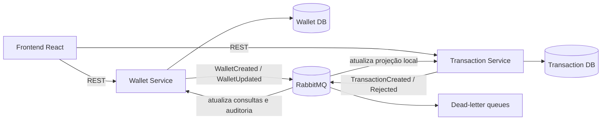

# Planejamento do TP4 e TP5

Este documento reúne o roteiro de evolução da plataforma bancária após o TP3.

## Pré-requisito: regularização do TP3

Antes da refatoração, será necessário recuperar e versionar o código-fonte do `transaction-service`. Atualmente, a pasta contém apenas o banco H2 e artefatos gerados em `target/` (inclusive o JAR compilado), enquanto arquivos essenciais como `pom.xml`, `src/main` e `src/test` não estão no repositório. Artefatos de build e bancos locais também deverão ser removidos do versionamento e adicionados ao `.gitignore`.

Depois da recuperação, a divisão de responsabilidades deverá ficar explícita:

- `backend` (futuro `wallet-service`): proprietário de usuários e carteiras;
- `transaction-service`: proprietário dos lançamentos, histórico e cálculo do saldo;
- `frontend`: cliente das APIs, sem acesso direto aos bancos ou ao RabbitMQ;
- cada microsserviço: banco e schema próprios, sem compartilhar tabelas.

## TP4 — Refatoração para arquitetura orientada a eventos

O objetivo será eliminar o acoplamento síncrono desnecessário entre o serviço de carteiras e o serviço de transações. O RabbitMQ será usado para distribuir eventos, enquanto REST continuará sendo utilizado na comunicação entre o usuário e o sistema.

### Arquitetura proposta

O `transaction-service` já compilado indica a existência de um `WalletClient` HTTP e de um `WalletLedger` local. No TP4, a validação síncrona pelo cliente HTTP deverá ser substituída, quando possível, por uma projeção local de carteiras mantida pelos eventos `WalletCreated` e `WalletUpdated`. Isso reduz a dependência de disponibilidade entre os serviços.

### Eventos e contratos

Será necessário definir contratos versionados e independentes das entidades JPA. Todo envelope de evento deverá possuir, no mínimo:

- `eventId`, para idempotência;
- `eventType` e `eventVersion`;
- `occurredAt`;
- `correlationId`, para rastreamento da operação;
- `source`;
- `payload` com apenas os dados necessários ao consumidor.

Eventos iniciais sugeridos:

| Evento | Produtor | Consumidor | Finalidade |
|---|---|---|---|
| `wallet.created.v1` | Wallet Service | Transaction Service | Criar a projeção local da carteira |
| `wallet.updated.v1` | Wallet Service | Transaction Service | Atualizar estado ou moeda da carteira |
| `transaction.created.v1` | Transaction Service | Wallet Service/auditoria | Informar lançamento confirmado |
| `transaction.rejected.v1` | Transaction Service | Wallet Service/auditoria | Informar falha de regra de negócio |

Para demonstrar diferentes padrões de mensagens, a implementação deverá incluir:

- publicação/assinatura com uma `topic exchange` para eventos de domínio;
- fila de trabalho para processamento assíncrono de comandos, caso a criação da transação retorne `202 Accepted`;
- filas de retry e dead-letter queue (DLQ) para mensagens que falharem;
- acknowledgements e política de reentrega controlados, evitando loops infinitos.

### Implementação com Spring Boot e RabbitMQ

As principais tarefas serão:

1. Adicionar `spring-boot-starter-amqp` aos serviços e configurar exchanges, queues, bindings e routing keys.
2. Criar publishers e listeners com `RabbitTemplate` e `@RabbitListener`.
3. Externalizar host, porta, usuário, senha, nomes de filas e exchanges por variáveis de ambiente.
4. Configurar serialização JSON e contratos de mensagem compartilhados apenas como DTOs versionados, sem compartilhar entidades de domínio.
5. Garantir idempotência no consumidor, registrando `eventId` já processados.
6. Usar publisher confirms e tratamento de mensagens não roteadas.
7. Aplicar o padrão transactional outbox, ou solução equivalente, para impedir que o dado seja confirmado no banco sem que o evento correspondente possa ser publicado.
8. Definir retry com backoff e encaminhamento final para DLQ.
9. Propagar `correlationId` nos logs, chamadas REST e mensagens.
10. Atualizar o frontend para exibir estados assíncronos, como `PENDING`, `COMPLETED` e `REJECTED`, se o fluxo por comandos for adotado.

### Testes necessários no TP4

- testes unitários dos publishers, listeners e regras de negócio;
- testes de contrato para validar o formato e a versão dos eventos;
- testes de integração com RabbitMQ real por meio de Testcontainers;
- teste de idempotência com entrega duplicada da mesma mensagem;
- teste de indisponibilidade temporária de um consumidor;
- teste de retry e envio para a DLQ;
- teste do fluxo completo: criação da carteira, propagação do evento, criação da transação e atualização das consultas;
- manutenção dos testes REST e de persistência já existentes.

### Documentação e demonstração do TP4

A documentação deverá conter a justificativa da arquitetura, seus prós e contras, o diagrama dos serviços, um diagrama de sequência do fluxo principal, catálogo de eventos, exchanges/queues/routing keys, estratégia de consistência eventual, idempotência, retry e DLQ.

Na apresentação, deverá ser demonstrado:

1. RabbitMQ e os serviços em execução;
2. criação de uma carteira e consumo de `wallet.created.v1`;
3. criação de uma transação e publicação de `transaction.created.v1`;
4. funcionamento do sistema mesmo com um consumidor temporariamente desligado;
5. processamento posterior da fila quando o consumidor retornar;
6. uma mensagem inválida sendo encaminhada para a DLQ;
7. ausência de duplicidade ao reenviar um evento com o mesmo `eventId`.

Também deverão ser apresentados os trade-offs. Entre os benefícios estão desacoplamento, escalabilidade por consumidores e maior tolerância a indisponibilidade temporária. Entre os custos estão consistência eventual, maior complexidade operacional, dificuldade de rastreamento e necessidade de idempotência e observabilidade.

## TP5 — Implantação e manutenção em produção

O objetivo será transformar a solução do TP4 em uma aplicação reproduzível, observável e validada automaticamente.

### Docker e ambiente local

Será necessário:

- criar um `Dockerfile` multi-stage para cada aplicação Spring Boot;
- criar um `Dockerfile` para compilar o React e servi-lo com Nginx;
- executar os processos com usuário não root e adicionar health checks;
- criar `.dockerignore` para reduzir as imagens;
- ampliar o `docker-compose.yml` com frontend, serviços, bancos independentes, RabbitMQ e ferramentas de observabilidade;
- usar volumes apenas para dados que precisam persistir;
- retirar senhas fixas das imagens e receber configurações por ambiente;
- fixar versões das imagens e documentar portas e dependências.

O Compose será o ambiente de desenvolvimento e demonstração local. Ele não substitui os manifestos Kubernetes.

### Kubernetes

Deverão ser criados manifestos, preferencialmente organizados em `k8s/`, contendo:

- `Deployment` para frontend e microsserviços;
- `Service` para descoberta e comunicação interna;
- `ConfigMap` para configurações não sensíveis;
- `Secret` para credenciais, mantendo apenas um exemplo seguro no Git;
- `Ingress` para expor frontend e APIs;
- `readinessProbe`, `livenessProbe` e `startupProbe` usando Spring Boot Actuator;
- `resources.requests` e `resources.limits`;
- `HorizontalPodAutoscaler` para ao menos um serviço stateless;
- estratégia de rolling update;
- persistência para componentes stateful no ambiente de demonstração, ou uso documentado de serviços gerenciados em produção;
- `Namespace` para isolar os recursos do projeto.

O Kubernetes não deverá executar H2 em arquivo com várias réplicas. Cada serviço deverá usar PostgreSQL próprio; RabbitMQ e bancos deverão ter persistência adequada ou serem tratados como dependências gerenciadas fora do cluster.

### Monitoramento e diagnóstico

Cada serviço deverá expor endpoints do Spring Boot Actuator, protegendo endpoints sensíveis. A pilha mínima sugerida é:

- Micrometer + Prometheus para métricas;
- Grafana para dashboards;
- logs estruturados em JSON, agregados com Loki/Promtail ou solução equivalente;
- OpenTelemetry com Tempo ou Jaeger para rastreamento distribuído;
- `traceId` e `correlationId` presentes nos logs e nas mensagens RabbitMQ.

Os dashboards deverão mostrar disponibilidade, latência e taxa de erros HTTP, uso de CPU/memória, conexões com banco, quantidade de mensagens, consumidores, retries e tamanho das DLQs. Também será necessário criar ao menos um alerta demonstrável, por exemplo serviço indisponível ou crescimento da DLQ.

### CI/CD com GitHub Actions

O pipeline deverá ser dividido em etapas claras:

1. checkout e cache das dependências;
2. build e testes dos microsserviços com Maven;
3. instalação, lint/testes e build do frontend;
4. testes de integração com PostgreSQL e RabbitMQ;
5. geração dos relatórios de cobertura;
6. análise de dependências e vulnerabilidades;
7. build das imagens Docker;
8. scan das imagens;
9. publicação em um registry usando tag imutável baseada no SHA do commit;
10. validação dos manifestos Kubernetes;
11. implantação automática em ambiente de desenvolvimento e implantação de produção protegida por aprovação.

Credenciais do registry e do cluster deverão ficar em GitHub Secrets. Pull requests deverão executar validação e testes, mas não fazer deploy de produção.

### Estratégia de testes do TP5

A entrega deverá manter uma pirâmide de testes:

- unitários para regras de negócio;
- integração para banco e RabbitMQ com Testcontainers;
- contratos de APIs e eventos;
- end-to-end para os principais fluxos do frontend até os serviços;
- smoke tests após o deploy;
- testes de resiliência desligando consumidores ou réplicas;
- teste de carga simples para demonstrar escalabilidade;
- verificação das probes, métricas, logs e traces.

### Documentação e demonstração do TP5

A documentação deverá explicar pré-requisitos, variáveis de ambiente, execução com Compose, implantação no Kubernetes, rollback, consulta de logs/métricas/traces, recuperação de mensagens da DLQ e funcionamento do pipeline de CI/CD.

Na demonstração final, deverão aparecer:

1. pipeline executando testes e construindo imagens;
2. aplicação implantada no cluster;
3. pods, services, ingress, probes e réplicas saudáveis;
4. fluxo completo de usuário, carteira e transação;
5. mensagens trafegando pelo RabbitMQ;
6. dashboard com métricas e logs correlacionados;
7. trace de uma operação entre componentes;
8. reinício ou escala de uma réplica sem perda do serviço;
9. rollback ou recuperação de uma falha simulada.

## Ordem recomendada de execução

1. Recuperar e versionar corretamente o `transaction-service`.
2. Consolidar os limites de domínio e remover a duplicidade de transações do monólito.
3. Criar os contratos de eventos e o RabbitMQ no Compose.
4. Implementar publishers, consumidores, idempotência, outbox, retry e DLQ.
5. Atualizar frontend, testes e documentação do TP4.
6. Criar imagens Docker e fechar o ambiente completo com Compose.
7. Adicionar Actuator, métricas, logs e tracing.
8. Criar e validar os manifestos Kubernetes.
9. Implementar o pipeline GitHub Actions.
10. Executar testes end-to-end, resiliência e a demonstração final do TP5.
