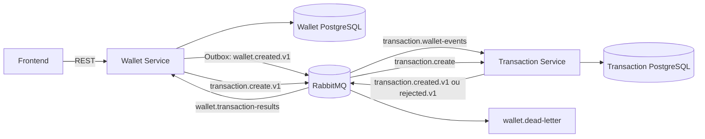

# Arquitetura orientada a eventos — TP4

## Objetivo

Documentar a transformação da comunicação síncrona entre os serviços para uma arquitetura orientada a eventos com RabbitMQ.

## Arquitetura anterior

No TP3, o `transaction-service` consultava o Wallet Service por Feign antes de criar, listar ou calcular o saldo. Essa dependência síncrona fazia uma operação de transação falhar sempre que o Wallet Service estivesse indisponível.

## Arquitetura proposta

O frontend continua usando REST. A comunicação de domínio entre os serviços utiliza RabbitMQ. O Transaction Service mantém uma projeção local das carteiras e não usa mais Feign para validar uma carteira.

## Responsabilidades

| Componente | Responsabilidade |
|---|---|
| Wallet Service | Gerenciar usuários e carteiras |
| Transaction Service | Gerenciar lançamentos, histórico e saldo |
| RabbitMQ | Transportar comandos e eventos entre os serviços |
| Frontend | Consumir as APIs REST e apresentar o estado das operações |

## Consistência e resiliência

- A carteira e seu registro de Outbox são persistidos na mesma transação local.
- O publicador envia os registros pendentes para `wallet.events`.
- O consumidor registra `eventId` em `processed_messages`, tornando a projeção idempotente.
- Comandos usam `commandId` como `external_reference` única, impedindo transações duplicadas.
- Falhas técnicas recebem até três tentativas e depois são encaminhadas para `wallet.dead-letter`.
- Entre a criação da carteira e o consumo do evento existe uma pequena janela de consistência eventual.

## Decisões arquiteturais

- REST foi mantido na borda para consultas e compatibilidade com o frontend.
- Eventos e comandos usam contratos versionados do módulo `messaging-contracts`, sem compartilhar entidades JPA.
- Foi adotada uma `topic exchange` para eventos e uma `direct exchange` para comandos.
- A criação síncrona de transação foi mantida por compatibilidade; `POST /api/transactions/async` demonstra o fluxo assíncrono.
