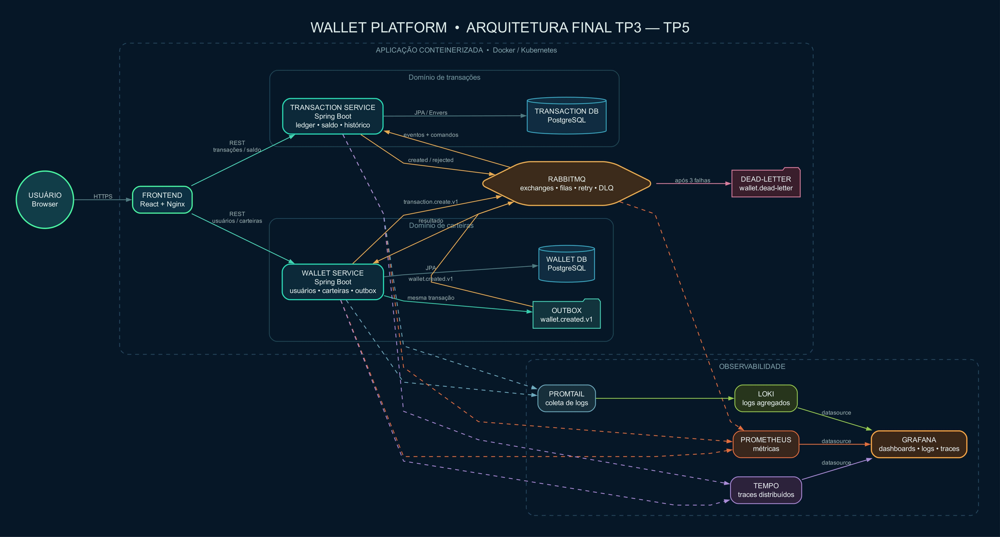
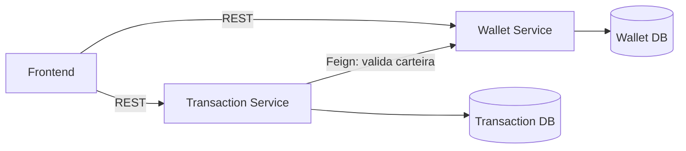
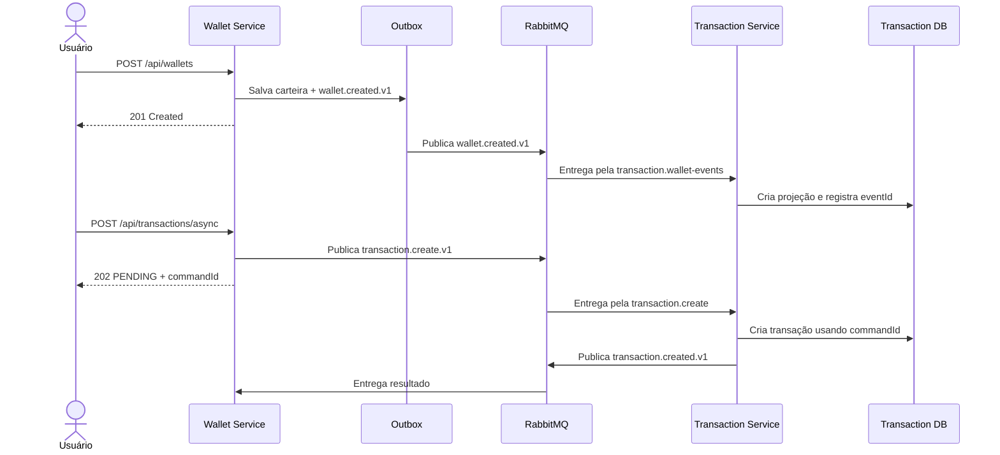
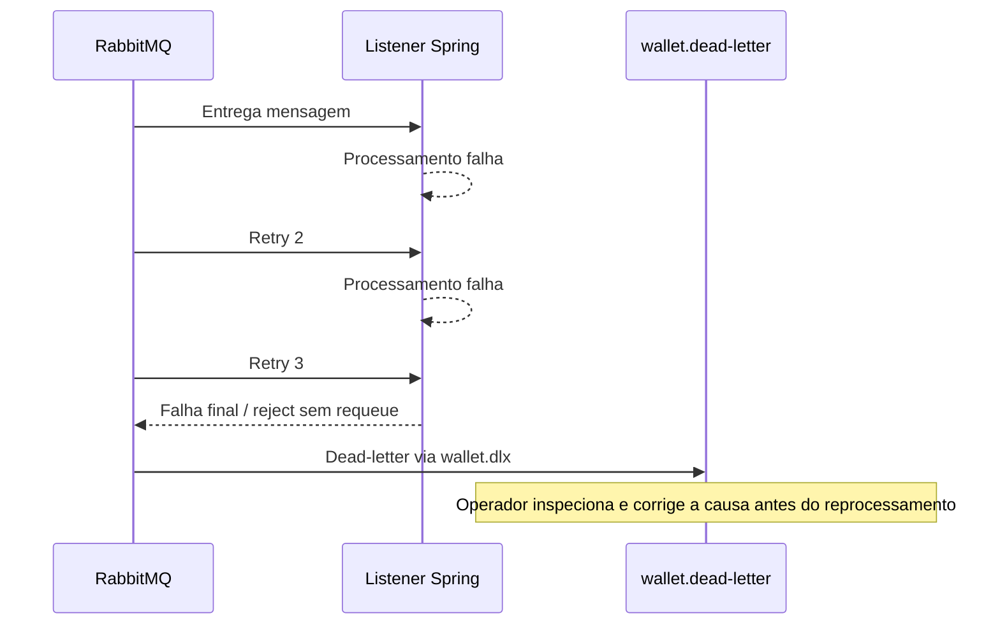
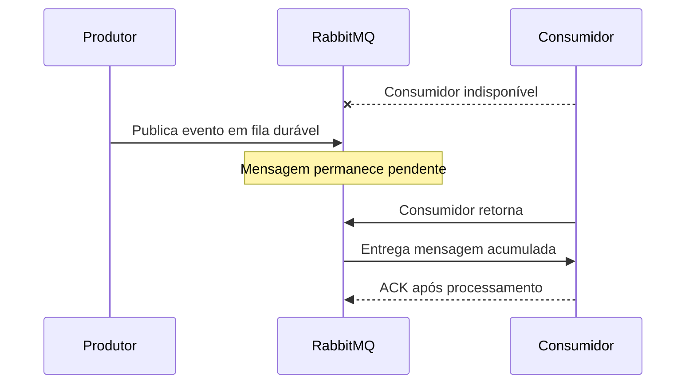

# Diagramas do TP4

Os diagramas estão em Mermaid para permanecerem versionáveis e renderizarem diretamente no GitHub. A arquitetura atual completa também aparece em [ARQUITETURA.md](../ARQUITETURA.md).

## Imagem pronta para a apresentação final

Abra esta imagem em tela cheia durante o vídeo:

- [abrir SVG em alta qualidade](../../TP5/diagramas/arquitetura-final.svg);
- [abrir PNG](../../TP5/diagramas/arquitetura-final.png).

O diagrama consolida a evolução do TP3 ao TP5: frontend, Wallet Service,
Transaction Service, bancos separados, RabbitMQ, Outbox, DLQ, Docker/Kubernetes
e a observabilidade com Prometheus, Promtail, Loki, Tempo e Grafana.

## Arquitetura anterior (TP3)

O Transaction Service dependia de uma resposta síncrona do Wallet Service para processar operações relacionadas a uma carteira.

## Sequência principal orientada a eventos

## Falha, retry e DLQ

## Consumidor indisponível

