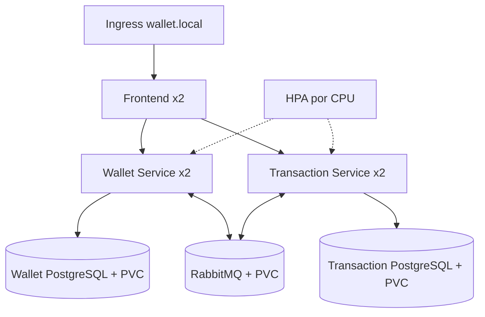

# Kubernetes — TP5

## Recursos

- [x] Namespace
- [x] Deployments
- [x] Services
- [x] ConfigMaps
- [x] Secrets
- [x] Ingress
- [x] Readiness e liveness probes
- [x] Requests e limits
- [x] Horizontal Pod Autoscaler
- [x] Persistência dos componentes stateful

## Arquitetura do cluster

## Implantação

Os arquivos estão em `k8s/` e são compostos pelo Kustomize. Use `kubectl kustomize k8s` para validar a renderização e `kubectl apply -k k8s` para aplicar todos os recursos no namespace `wallet-platform`.

## Escalabilidade e atualização

Wallet e Transaction Service começam com duas réplicas. O HPA escala cada um entre duas e cinco réplicas quando a utilização média de CPU ultrapassa 70%. Requests permitem o cálculo do HPA, limits evitam consumo sem limite, probes impedem tráfego antes da prontidão e reiniciam processos travados. Deployments usam rolling update por padrão e mantêm o histórico necessário para `kubectl rollout undo`.

## Evidências

Na gravação, registrar `kubectl get deploy,pods,svc,hpa,ingress,pvc -n wallet-platform`, apagar um pod de aplicação e mostrar a reposição automática. Não exibir o conteúdo de Secrets.
